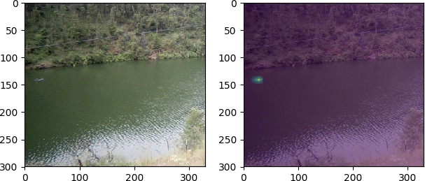
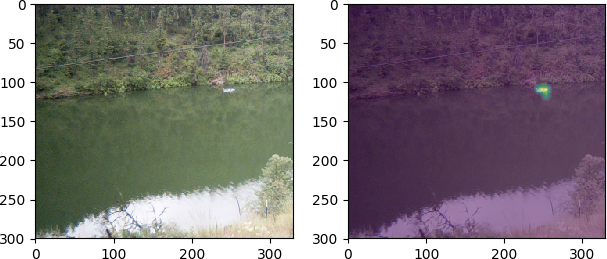
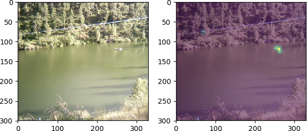

Run the main.py file to load the model and get the boat location predictions of the lake images in the "images" folder.

The results should look like this:

(The left-hand side is the original image; and the right-hand side is the predicted boat location by the model)

